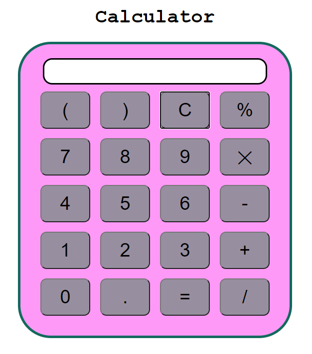

# Calculator
Very basic calculator created by html, css, js.

# Screenshot

# Installation 🔌
1. Press the Fork button (located on the top right corner of the page) to save copy of this project on your account.
2. Download the repository files (project) from the download section or clone this project by typing in the bash the following command: git clone https://github.com/nikita-jain-01/Calculator

# Thank You!
Please ⭐️ this repo and share it with others
